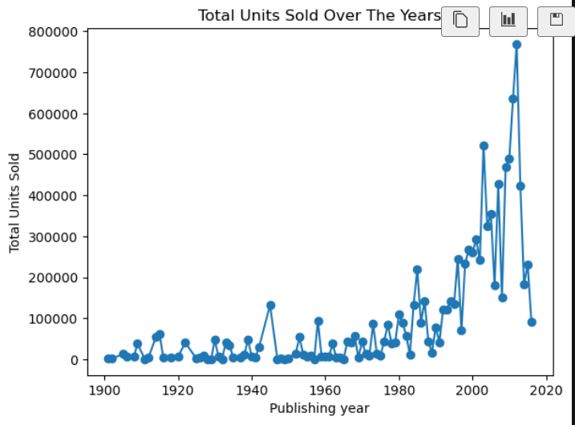
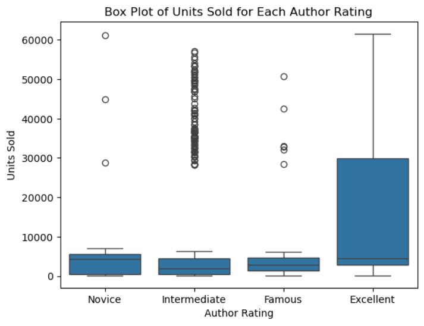
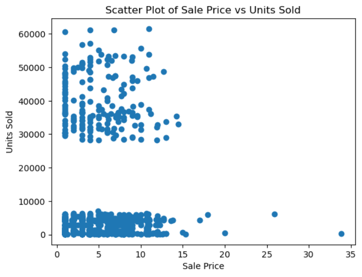

<div align="center">

# 📚 Books Data Analysis

### Exploratory Data Analysis of Book Sales, Ratings, Authors & Publishers

<p>
  
  
  
</p>

<p>
  <a href="https://www.python.org/"></a>&nbsp;&nbsp;
  <a href="https://pandas.pydata.org/"></a>&nbsp;&nbsp;
  <a href="https://numpy.org/"></a>&nbsp;&nbsp;
  <a href="https://matplotlib.org/"></a>&nbsp;&nbsp;
  <a href="https://seaborn.pydata.org/"></a>&nbsp;&nbsp;
  <a href="https://jupyter.org/"></a>&nbsp;&nbsp;
  <a href="https://git-scm.com/"></a>&nbsp;&nbsp;
  <a href="https://github.com/"></a>
</p>

</div>

---

## 📖 Overview

This project explores a dataset of **1,070 books** to uncover patterns in **publishing trends, genres, author ratings, languages, sales and publisher revenue**. Using Python's data science stack, the notebook cleans the data, answers key business questions and visualizes the results.

## 🎯 Objectives

- 🧹 Clean and prepare the dataset for analysis
- 📈 Understand publishing trends across the years
- 🏷️ Compare genres by popularity and reader engagement
- ✍️ Identify top authors by rating and gross sales
- 💰 Analyze the relationship between price and units sold
- 🏢 Evaluate publisher revenue and language distribution

## 🗂️ Dataset

**File:** `Books_Data_Clean.csv` &nbsp;|&nbsp; **Rows:** 1,070 &nbsp;|&nbsp; **Columns:** 15

| Column | Description |
|---|---|
| `Publishing Year` | Year the book was published |
| `Book Name` | Title of the book |
| `Author` | Author(s) of the book |
| `language_code` | Language of the book |
| `Author_Rating` | Author category (e.g. Novice, Intermediate) |
| `Book_average_rating` | Average reader rating |
| `Book_ratings_count` | Number of ratings received |
| `genre` | Book genre |
| `gross sales` | Total gross sales |
| `publisher revenue` | Revenue earned by the publisher |
| `sale price` | Price the book was sold at |
| `sales rank` | Sales ranking |
| `Publisher` | Publishing company |
| `units sold` | Number of units sold |

## 🔍 Analysis Workflow

1. **Load data** with Pandas
2. **Inspect** structure using `info()`, `head()`, `describe()`
3. **Clean** invalid records (filtered `Publishing Year > 1900`) and check for missing values
4. **Explore** unique values and group-level statistics
5. **Visualize** trends and distributions with Matplotlib & Seaborn

## 📊 Key Visualizations & Insights

### 📈 Total Units Sold Over the Years
<p align="center">
  
</p>

> Sales stay low for most of the 20th century, start growing from the 1980s and **peak around 2012 (~770K units)**. The drop after 2012 is likely due to fewer records in the dataset for the latest years.

---

### 📦 Units Sold by Author Rating
<p align="center">
  
</p>

> **"Excellent" authors have by far the widest spread**, with the top quarter of their books selling around 30K+ units. Intermediate authors show many high-selling outliers, while most books in every group sell fewer than ~6K units.

---

### 💰 Sale Price vs Units Sold
<p align="center">
  
</p>

> **Price alone doesn't explain sales.** Books split into two clear groups: low sellers (under ~7K units) and bestsellers (28K to 61K units), and both groups exist at almost every price point. Very expensive books (above $15) rarely sell many units.

---

### 🗒️ All Charts in the Notebook

| Chart | What it shows |
|---|---|
| 📊 Histogram | Distribution of publishing years |
| 📊 Bar chart | Number of books per genre |
| 📦 Box plot | Ratings count by genre |
| 🔵 Scatter plot | Sale price vs. units sold |
| 🥧 Pie chart | Language distribution of books |
| 🔵 Scatter plot | Average rating vs. ratings count |
| 📊 Bar chart | Top 20 authors by total gross sales |
| 📦 Box plot | Units sold by author rating |
| 📈 Line chart | Total units sold over the years |

## 🛠️ Tech Stack

| Tool | Purpose |
|---|---|
|  | Core programming language |
|  | Data loading, cleaning & aggregation |
|  | Basic plotting |
|  | Statistical visualization |
|  | Interactive notebook environment |

## 🚀 Getting Started

### 1. Clone the repository

```bash
git clone https://github.com/<your-username>/<your-repo-name>.git
cd <your-repo-name>
```

### 2. Install dependencies

```bash
pip install pandas matplotlib seaborn jupyter
```

### 3. Launch the notebook

```bash
jupyter notebook Notebook.ipynb
```

> 💡 Make sure `Books_Data_Clean.csv` is in the same folder as the notebook.

## 📁 Project Structure

```
📦 books-data-analysis
 ┣ 📓 Notebook.ipynb
 ┣ 📄 Books_Data_Clean.csv
 ┣ 🖼️ images/
 ┗ 📄 README.md
```

## 🔮 Future Improvements

- Add a correlation heatmap for numeric features
- Build a predictive model for `units sold`
- Create an interactive dashboard (Plotly / Streamlit)
- Clean multi-author and language-code inconsistencies

## 🤝 Contributing

Contributions, issues and feature requests are welcome! Feel free to open an issue or submit a pull request.

## 📬 Contact

**Your Name** &nbsp;·&nbsp; [GitHub](https://github.com/Abdullahstack24) &nbsp;·&nbsp; [LinkedIn](https://linkedin.com/in/abdullah-mehmood-/) 

---

<div align="center">

⭐ If you found this project useful, please give it a star! ⭐

</div>
